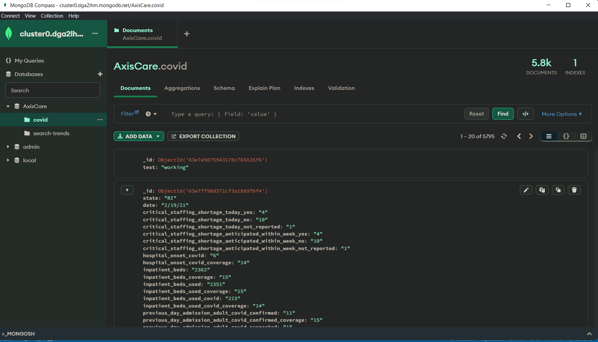
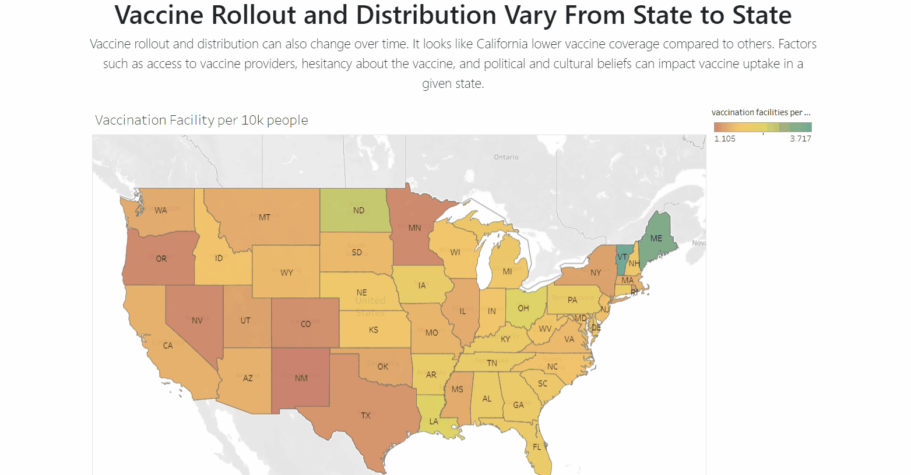
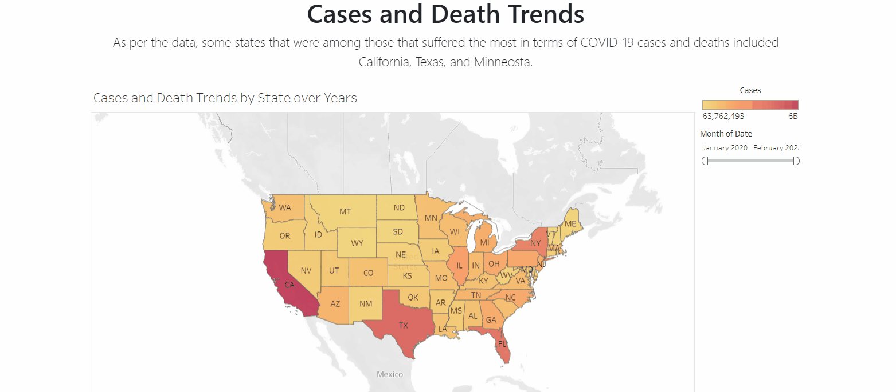
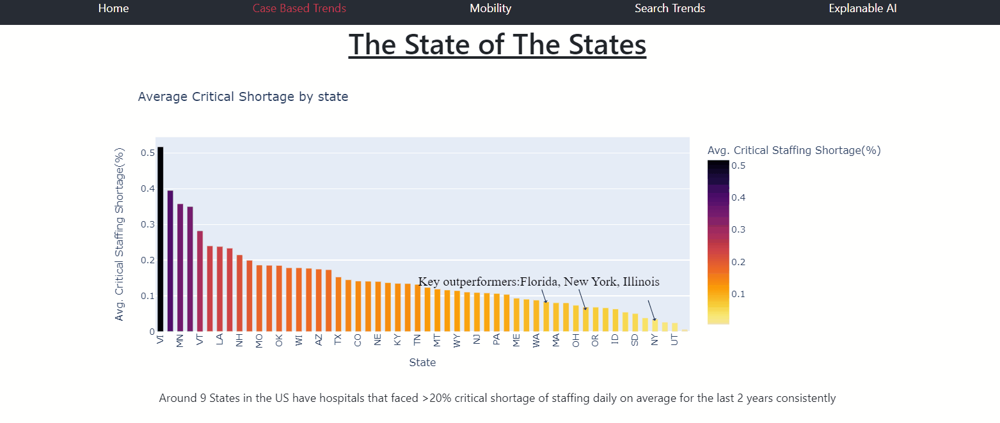
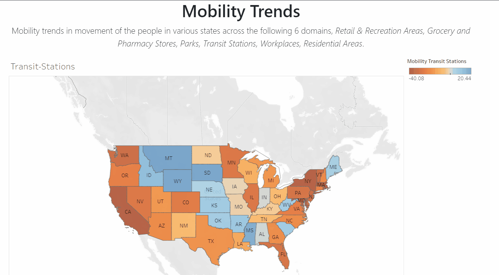
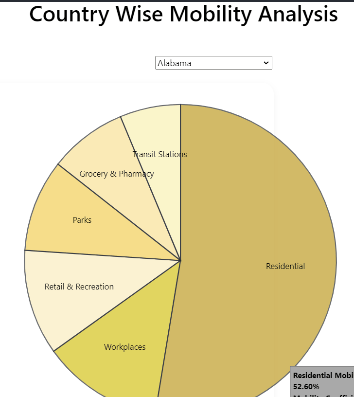

# AxisCare

# Data
[Google COVID-19 Open Data Repository](https://health.google.com/covid-19/open-data/)

This data repository is one of the most comprehensive collections of up-to-date COVID-19-related information. Comprising of data from more than twenty thousand locations worldwide, it contains a rich variety of data types to help public health professionals, researchers and policymakers in understanding and managing the virus.

The data is hosted on MongoDB. 

__Size:__  The size of the aggregated dataset is ~22.52 GB, pre-processing.

# Installation Instructions
To install the application locally:

- Clone the git repository `git clone https://github.com/shubhlohiya/axiscare.git`
- Use Python version 3.7 or higher
- Run `pip install -r requirements.txt` to install the required dependencies
- Run the following command in the app's directory to run the webapp locally `python app.py`
- Go to http://127.0.0.1:5000/ to view the application

# Demo Video
- [AxisCare Demo](https://youtu.be/Sui4tySv5nc) can be viewed to grasp a brief understanding on how one may leverage this dashboard

# AxisCare Dashboard

## Vaccination Facility per 10k

## Cases vs Death

## Case Based Trends

## Mobility US Analysis

## Mobility Pie Chart Analysis (State Wise - US)

## Inspiration
_Access to timely health care is a fundamental human right._

Data proves that the pandemic may have seen far fewer deaths if the mass populations had access to the needed healthcare services. 

Our primary motivation was to explore the state of healthcare access in the United States in the last few years in order to highlight the recent state of healthcare access. There was a need to identify through insight the actions the various states may take in order to bridge the disconnect present in accessibility to the medical facilities, resources, and means available today.

## What it does
AxisCare is a data-driven interactive dashboard that provides rich data insights and derives meaningful inferences through the analysis conducted, highlighting the areas various states must focus on in order to bridge the present gaps in access to healthcare.

## How we built it
We build AxisCare using Python (Flask), MongoDB Atlas (NoSQL), Tableau, Plotly (Python), Numpy, Pandas, Git, HTML, CSS, jQuery, Bootstrap, and JavaScript.

We also secured a domain: careaxis.tech through domain.com for AxisCare.

Being a team of 4, we worked on defining the problem statement based on the Elevance Challenge - "Access to Care." We collated datasets that contained data specific to facilities, mobility, vaccination rates and Google Search trends. We conducted our analysis on Access to Care with the accessibility to resources during the pandemic.

__Samaksh__ worked on cleaning, analyzing, pipelining, and visualizing the vaccination and mobility data on Tableau. __Shubham__ and __Saksham__ worked on the data analysis and visualization for vaccination and case-based covid data using Python (Numpy, Pandas and Plotly). __Schezeen__ worked on the end-to-end webapp built using a HTML, CSS and JS frontend and served using a Python (Flask) backend. The data was retrieved from a cluster hosted on MongoDB Atlas.

We worked as a team, each motivating the other to pull through and focus on the bigger picture. We had a lot of fun working together and have learned a lot through the process, the insights we got through the data, and delivering the project!

## Challenges we ran into
The main challenge we ran through was securing relevant, complete, and suitable datasets for the exploration, analysis and visualization on understanding the accessibility to care. We worked with the data we could find, produced cross-correlated datasets during the data preparation phase and cleaned out the irrelevant data to overcome this challenge.

## Accomplishments that we're proud of
We are proud of the application we have built and the ability to draw inferences from our analysis. We are super proud of each other for working and collaborating as a team as we learnt a lot through the process.

## What we learned
We learned how to work with the datasets available in order to solve for a problem. We understood the importance of teamwork and a lot from each other, as we all brought our best experiences and expertise to the hackathon! We learned how to deliver an end-to-end project :D 

## What's next for AxisCare
We hope to continue using more recent data in order to strengthen the insights we gain from the data. We hope to address the gaps evident using the data to find areas in which states, governments, and policy makers need to divert their attention and focus to when it comes to the accessibility of healthcare.

# Build by: Saksham Arora, Samaksh Gulati, Schezeen Fazulbhoy and Shubham Lohiya _(Go Jackets!!!)_
